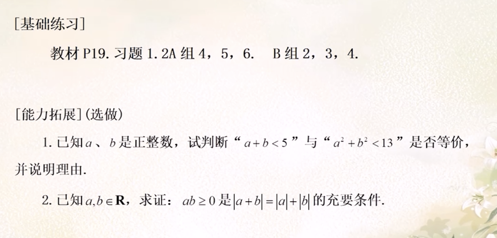

<section id="title">常用逻辑用语（2）</section>

# 充分条件，必要条件

## 定义

对于两个陈述句α和β，如果α⇒β，那么就称α是β的充分条件（sufficient condition），亦称β是α的必要条件（necessary condition）。

该定义中，“充分”二字说明α成立时，β一定成立。而“必要”二字说明β不成立时，α一定不成立。需要注意的是，这里的充分条件和必要条件对应的是同一个关系，即α⇒β。

# 作业

