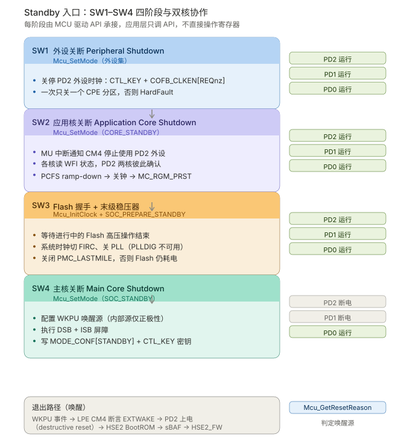

# S32K5 MCAL 驱动 API 与休眠设计方案映射分析

**分析对象**：`S32K5_R52_M7_休眠方案_CN.md` / `S32K5_R52_M7_Sleep_Design_EN.md`（已修订版）
**分析基准**（取自 IMA 知识库「米多papa的知识库 / MCAL」文件夹）

| 文档 | 编号 | 说明 |
|---|---|---|
| User Manual for S32K5 MCU Driver | **UM85MCUASRR23-11 Rev. 1.0** | NXP 实现的 S32K5 MCU 驱动用户手册（231 页） |
| Integration Manual for S32K5 MCU Driver | **IM85MCUASRR23-11 Rev. 1.0** | 集成手册（编译器/链接器选项、必需文件） |
| Specification of MCU Driver | **AUTOSAR CP R23-11** (SWS_MCUDriver) | AUTOSAR 官方规范，54 页 |
| Requirements on MCU Driver | **AUTOSAR CP R23-11** (SRS_MCUDriver) | AUTOSAR 官方需求，17 页 |

> ✅ **关键确认**：该 MCU 驱动 User Manual 的「Supported Derivatives」明确列出 **s32k566_lfbga324 / s32k566_lfbga437**，即**与本文档的 S32K566 目标完全一致**。这套 API 就是为你的芯片提供的。

---

## 一、核心结论

设计文档描述的是**底层寄存器级流程**，而 MCAL MCU 驱动已经把这套流程**封装成了标准 AUTOSAR 服务**。二者关系是：**文档流程 ≈ MCU 驱动内部实现**，绝大多数步骤不需要应用层手写。

但有 **3 个关键缺口**：设计文档完全没提 MCAL 驱动的存在，导致集成时会出现职责空白。详见第四节。

---

## 二、S32K5 MCU 驱动覆盖的 API 清单

AUTOSAR SWS R23-11 定义的 MCU 驱动服务共 11 个，S32K5 MCU 驱动实现情况如下（Service ID 以 SWS R23-11 原文为准）：

| 服务名 | Service ID | 同步/异步 | 可重入 | 与休眠方案的关系 |
|---|---|---|---|---|
| `Mcu_Init` | 0x01 | 同步 | 可重入 | **前置**：所有其他 API 前必须先调用 |
| `Mcu_InitRamSection` | 0x02 | 同步 | 可重入 | PD0 SRAM 段初始化 |
| `Mcu_InitClock` | 0x03 | 同步 | 可重入 | ⭐ **SW3/SW4 都要用**：切系统时钟到 FIRC、关 PLL |
| `Mcu_DistributePllClock` | 0x04 | 同步 | 可重入 | 唤醒后重新分发 PLL 时钟（S32K5 有偏差，见下） |
| `Mcu_GetPllStatus` | 0x05 | 同步 | 可重入 | 查询 PLL 锁定状态 |
| `Mcu_GetResetReason` | 0x06 | 同步 | 可重入 | ⭐ **唤醒后判断为何被唤醒** |
| `Mcu_GetResetRawValue` | 0x07 | 同步 | 可重入 | 读取原始复位寄存器值 |
| **`Mcu_SetMode`** | **0x08** | **同步** | **可重入** | ⭐⭐ **本方案的核心 API** |
| `Mcu_GetVersionInfo` | 0x09 | 同步 | 可重入 | 版本查询 |
| `Mcu_PerformReset` | 0x0a | 同步 | 可重入 | 触发软件复位（受 `McuPerformResetApi` 编译开关控制，见 SWS_Mcu_00146） |
| `Mcu_GetRamState` | 0x0b | 同步 | 可重入 | 查询 RAM 内容状态（S32K5 标注为 `BSW13701` 可选） |

> ⚠️ **Service ID 注意事项**：`Mcu_PerformReset` 在 SWS 中是**条件服务**（`SWS_Mcu_00146`：仅当 `McuPerformResetApi` 为 TRUE 时提供），因此其编号在不同 AUTOSAR 版本间存在偏移。本表按 R23-11 原文排列，**实际取值请以你所用 MCAL 版本的 `Mcu_Cfg.h` / `Mcu.h` 为准**。

### 与休眠方案直接相关的三个 API

**1. `Mcu_SetMode` — 核心 API**

```c
void Mcu_SetMode (Mcu_ModeType McuMode);
```

SWS 定义的关键约束（SWS_Mcu_00147）：

> *The function Mcu_SetMode shall set the MCU power mode. **In case of CPU power down mode, the function Mcu_SetMode returns after it has performed a wake-up.***

SWS_Mcu_00148：

> *The MCU module's environment shall only call the function Mcu_SetMode **after the MCU module has been initialized by the function Mcu_Init**.*

**两条重要 Note（SWS 原文）**：

> *Note: The environment of the function Mcu_SetMode has to ensure that the ECU is ready for reduced power mode activation.*
>
> *Note: The API Mcu_SetMode **assumes that all interrupts are disabled prior the call** of the API by the calling instance. The implementation has to take care that **no wakeup interrupt event is lost**. This could be achieved by a check whether pending wakeup interrupts already have occurred even if Mcu_SetMode has not set the controller to power down mode yet.*

**2. `Mcu_InitClock` — 时钟切换**

负责 SW3/SW4 的时钟动作：把系统时钟切到 FIRC、关闭 PLL。S32K5 MCU 驱动 User Manual 明确：

> Before entering the software Standby mode sequence, **the system clock source must be changed to FIRC because PLLDIG is not available in Standby mode**. In this mode, all clock sources can be optionally disabled (including FIRC, which results in a **no-clock, low-power consumption mode**). You could use **FXOSC, if enabled, when the 2.5 V supply is available** by appropriate configuration of **PMC's CONFIG[LPM25EN]**.

**3. `Mcu_GetResetReason` — 唤醒源判定**

唤醒后判断是哪个复位源导致唤醒（对应你文档中「唤醒原因」共享区）。

---

## 三、驱动内部实现：SW1–SW4 四阶段

**这是本次分析最关键的发现**。S32K5 MCU 驱动 User Manual §3.6.6 明确给出了进入低功耗模式的完整软件阶段划分，**与设计文档的步骤高度对应**：



| 阶段 | 名称 | 驱动 API 调用 | 对应设计文档步骤 |
|---|---|---|---|
| **SW1** | Peripheral Shutdown | `Mcu_SetMode`（外设关断集） | 第 4 节 Step 4.1-4.3 关停 PD2 外设 |
| **SW2** | Application Core Shutdown | 应用核调 `Mcu_SetMode(CORE_STANDBY)`；主核调 `Mcu_SetMode`（`McuCoreUnderMcuControl` 勾选 + `McuCoreClockEnable` 取消勾选） | 第 4 节 Step 2-3 WFI 协调与关钟 |
| **SW3** | Flash Low-Power Handshake + PMC_LASTMILE Regulator Disable | `Mcu_InitClock`（切 FIRC、关 PLL）；`Mcu_SetMode(SOC_PREPARE_STANDBY)` | 设计文档**未覆盖**（见缺口 1） |
| **SW4** | Main Core Shutdown | 配置唤醒 IP；`Mcu_SetMode(SOC_STANDBY)`，`McuMainCoreSelect` 设为执行该转换的核 | 第 4 节 Step 4.7-4.10 请求模式切换 |

### SW2 的两步握手（与你的设计文档高度一致）

User Manual 原文：

> 1. From the main core, **request the application core(s) to stop**.
> 2. Transition the application core(s) into standby (i.e. the application core(s) must call `Mcu_SetMode` with a mode configuration having **"McuPowerMode" = CORE_STANDBY**)
> 3. From the main core, shutdown the application core(s) (i.e. the main core must call `Mcu_SetMode` with a mode configuration having the **"McuCoreUnderMcuControl"** checkbox(es) checked and **"McuCoreClockEnable"** checkbox(es) unchecked for the application core(s) to be shutdown)

这印证了你文档第 4 节「Requestor Core 协调其他核心 WFI 再关钟」的设计是**符合驱动实现思路的**。

### 关键配置参数（Tresos / MCAL 配置）

| 参数 | 作用 |
|---|---|
| `McuPowerMode` = `CORE_STANDBY` | 应用核自身进入 Standby |
| `McuPowerMode` = `SOC_PREPARE_STANDBY` | SoC 预备阶段（SW3） |
| `McuPowerMode` = `SOC_STANDBY` | SoC 真正进入 Standby（SW4） |
| `McuCoreUnderMcuControl` | 勾选表示该核/分区由 MCU 驱动接管（**取消勾选则应用自己管**） |
| `McuCoreClockEnable` | 控制该核时钟开关 |
| `McuMainCoreSelect` | 指定执行 Standby 转换的主核 |

**User Manual 的重要配置建议（§3.6.2）**：

> For **bypassing** the configuration of a Partition, COFB set, or Core during `Mcu_SetMode`, the corresponding **"[Block] Under MCU Control" checkbox should be unchecked**. This will generate smaller configurations that NXP will be updated faster and more efficiently. In addition, if the application is configuring a certain mode in advance, the UnderMcuControl should be unchecked so the MCU driver does not overwrite the initial settings.
>
> **Note: Clock for main Core must be always enabled** by `McuCoreUnderMcuControl` should be unchecked if main core configured by application or `McuCoreUnderMcuControl` and `McuCoreClockEnable` must be checked together.

> ⚠️ **这条对你的双核方案很关键**：主核时钟必须保持使能。若主核由应用自己配置，需同时勾选 `McuCoreUnderMcuControl` 与 `McuCoreClockEnable`，否则关断时会出问题。

### 时钟模式选项（§3.6.7）

| 选项 | 模式 | CORE_CLK | 可用模式 |
|---|---|---|---|
| A | High Performance | 160 MHz | 仅 Run |
| B | Reduced Speed | 120 MHz | 仅 Run |
| C | Boot Standby | 24 MHz | Standby |
| D | Low-Speed RUN | 48 MHz | — |
| E | Low-Speed Run | 3 MHz | — |
| E2 | Very-Low-Speed Run | 750 kHz | — |
| F | 1:1 模式（CORE_CLK = AXBS_CLK） | — | 仅 Run |

---

## 四、设计文档的 3 个集成缺口

### 缺口 1：SW3 阶段完全缺失 ⭐ 最重要

**设计文档现状**：第 4 节 Step 4 的 10 步里，**没有 Flash 低功耗握手，也没有 PMC_LASTMILE 稳压器关闭**。

**驱动要求**（User Manual §3.6.6.3 原文）：

> The application will disable the PLL (and optionally disable FIRC/SIRC/SXOSC/FXOSC as per power consumption requirement in order to reduce power consumption in STANDBY mode) and **ensure that no flash high voltage operations are ongoing**.
>
> 1. **Suspend or wait for any ongoing flash high voltage operations.**
> 2. Configure FIRC as the system clock and disable the PLL (i.e. call `Mcu_InitClock` with such a clock configuration)
> 3. Prepare the SoC for standby mode (i.e. call `Mcu_SetMode` with a mode configuration having "McuPowerMode" = `SOC_PREPARE_STANDBY`)

**为什么这一步不可省**：`PMC_LASTMILE` 是给 MRAM/Flash 供电的末级稳压器。Standby 下若不关，Flash 阵列仍耗电，**低功耗目标直接落空**。而「等待 Flash 高压操作结束」若省略，Flash 编程中途掉电会导致**非确定性行为**（User Manual §3.6.3 也强调过 flash 编程模型在操作中途被修改会导致 non-deterministic behavior）。

**修订建议**：在设计文档第 4 节 Step 4 插入 SW3 阶段：
```
SW3: Flash 低功耗握手与 PMC_LASTMILE 关闭
  a. 挂起或等待进行中的 Flash 高压操作结束
  b. 切换系统时钟到 FIRC，关闭 PLL（驱动 API：Mcu_InitClock）
  c. 配置 SoC 进入 Standby 预备态（驱动 API：Mcu_SetMode, McuPowerMode = SOC_PREPARE_STANDBY）
```

---

### 缺口 2：未说明 EcuM 的唤醒中断责任

**User Manual §3.6.6 Note 原文**：

> **The EcuM shall ensure that no wakeup interrupt event is lost.** The MCU driver cannot handle wakeup interrupt as it doesn't have any information related to those. It is responsibility of the application to ensure that **no wakeup interrupt occurs before the SoC completes the standby mode transition**.

**SWS_Mcu_00147 的 Note 也要求**：

> The API Mcu_SetMode assumes that **all interrupts are disabled prior the call** of the API by the calling instance. The implementation has to take care that no wakeup interrupt event is lost. This could be achieved by a check whether pending wakeup interrupts already have occurred even if `Mcu_SetMode` has not set the controller to power down mode yet.

**设计文档现状**：第 7 节总结表完全没提中断使能/屏蔽的责任划分，也没提 EcuM。

**这是一个真实的功能风险**：若在 `Mcu_SetMode` 调用前有唤醒中断 pending，可能丢事件。设计文档第 4 节虽然写了「Requestor Core 先 Disable IRQ」，但**没有说明这是 AUTOSAR 的强制前提，也没有说明唤醒中断的检查责任在 EcuM**。

**修订建议**：在第 7 节总结表增加一行：
| **中断责任** | 调用 `Mcu_SetMode` 前**必须屏蔽所有中断**；**EcuM 负责确保无唤醒中断丢失**（MCU 驱动无法感知） |

---

### 缺口 3：LPM25EN（2.5V 供电才能用 FXOSC）未提及

**User Manual §3.6.6 原文**：

> You could use **FXOSC, if enabled, when the 2.5 V supply is available** by appropriate configuration of **PMC's CONFIG[LPM25EN]**.

**设计文档现状**：第 4 节 Step 4.4 只写「切换系统时钟到 FRO，关闭 PLL」，**没提 FIRC / FXOSC 的选择条件，也没提 LPM25EN**。

**结合我上一轮的 RM 核对**，这里有个值得注意的差异：
- **RM Ch53 §53.3.2.2** 说 LPRUN 下应用需切到「FXOSC, SXOSC, SIRC, FIRC」这些时钟
- **MCU 驱动 UM** 说 Standby 前**必须切到 FIRC**，因为 PLLDIG 不可用；并额外提到 LPM25EN 与 2.5V 供电

两者不冲突（FIRC 也在 RM 列出的可用时钟中），但**驱动把「切 FIRC」定为 Standby 的强制动作**，比你文档写的「切 FRO」更严格。FRO 属 PD0 常开时钟，而驱动选择 FIRC 是因为 FIRC 在 Standby 下仍活动且 HSE2 可配置它。

**修订建议**：Step 4.4 改为：
```
4. 切换系统时钟到 FIRC，关闭 PLL（LPRUN/Standby 下 PLLDIG 不可用）
   - Standby 入口必须切 FIRC（驱动要求）
   - 若 2.5V 供电可用且已配置 PMC.CONFIG[LPM25EN]，可用 FXOSC
   - 所有时钟源均可选关闭（含 FIRC），全关即 no-clock 最低功耗模式
```

---

## 五、S32K5 驱动已知偏差与限制（影响方案实现）

### 5.1 与 AUTOSAR 规范的偏差（§3.4 Deviations）

| Requirement | 状态 | 说明 | 对方案的影响 |
|---|---|---|---|
| `SWS_Mcu_00053` | N/S | 时钟失败通知 `MCU_E_CLOCK_FAILURE` 无法在 ISR 上下文上报，改用 `MCU_E_ISR_CLOCK_FAILURE` 由 CMU 中断上报 | **LPRUN 切换时钟时若发生时钟失败**，走的不是标准错误码，需按 S32K5 变体处理 |
| `SWS_Mcu_00056` | N/S | `Mcu_DistributePllClock` 在 PLL 已被硬件自动激活时**仍会改动硬件**，且**切换到 PLL 的动作不由 `Mcu_InitClock` 完成** | ⚠️ **重要**：唤醒后恢复 PLL 时钟需要显式调用 `Mcu_DistributePllClock`，不能指望 `Mcu_InitClock` 顺带完成 |
| `SWS_Mcu_00259` | N/S | 不支持的分区分区映射配置拒绝检查（基于 ticket AAI-462，不适用） | — |
| `SWS_Mcu_CONSTR_00001` | N/S | 「模块在各分区独立实例运行」不适用（基于 ticket AAI-462） | — |

> **`SWS_Mcu_00056` 这一条对你的唤醒流程影响最大**：设计文档第 5 节唤醒流程写「PD2 上电 → HSE2_FW 使能应用核 → 恢复上下文 → 回到 RUN」，但**没有提时钟如何恢复**。PLL 恢复需要单独调 `Mcu_DistributePllClock`。

### 5.2 驱动限制（§3.5 Limitations）

| 限制 | 后果 | 与方案的关系 |
|---|---|---|
| **Selecting PowerOffState for CPE_LLC0/CPE_LLC1 会导致 HardFault**，因为驱动仍尝试读写无供电的分区 | 规避：选 PowerOnState | ⚠️ **若你的关断流程涉及 CPE_LLC**（Cache），必须注意 |
| **同时禁用 PARTITION_CPE_0_INDEX 和 PARTITION_CPE_1_INDEX 会 HardFault**：禁用 CPE_1 会关闭整个 CPE 系统，导致后续禁用 CPE_0 时 HardFault | 规避：**一次只禁用一个 CPE 分区** | ⚠️ **直接约束 Step 4 的外设/分区关断顺序** |
| 核心启动地址的 linker symbol 是硬编码的 | 更换核需改链接脚本 | 涉及 M7/R52 分核启动 |
| 不支持 Design Studio 的示例工程；时钟树频率无法导出到 `McuClockReferencePoint` 表 | 需自定义参考点 | 配置阶段注意 |
| 多个时钟的频率上下限被设为 0–10 GHz（RM/DS 未提供明确信息） | 频率检查形同虚设 | 时钟配置需人工核对 |

> **5.2 的第二条是硬约束**：`Disable only one CPE partition at a time (PARTITION_CPE_0_INDEX or PARTITION_CPE_1_INDEX)`。你的设计文档第 4 节 Step 4.2 写「关停 PD2 外设时钟」时，若涉及 CPE 分区，**必须按分区逐个关，不能批量关**。

---

## 六、MCAL 分层职责划分建议

基于以上分析，设计文档应补充以下职责边界：

| 层 | 职责 | 具体内容 |
|---|---|---|
| **应用 / OS（两个 OS 各自）** | 上下文保存、任务停止、唤醒源配置 | 保存上下文到 PD0 SRAM；停任务；配置 WKPU；置位「本核已就绪」标志；执行 WFI |
| **核间通信（MU 中断）** | 休眠握手 | 通知 CM4 停止用 PD2 外设；Requestor Core 收集各核 WFI 状态 |
| **EcuM** | 唤醒中断不丢失 | ⭐ 保证进入 Standby 前无 pending 唤醒中断；模式转换期间不产生唤醒中断 |
| **MCU 驱动（MCAL）** | ⭐ 寄存器级全部流程 | SW1 外设关断 / SW2 核关断 / SW3 Flash 握手 + PMC_LASTMILE / SW4 主核关断；时钟切换；`Mcu_GetResetReason` |
| **MCAL 配置（Tresos）** | 静态配置 | `McuPowerMode`、`McuCoreUnderMcuControl`、`McuCoreClockEnable`、`McuMainCoreSelect`、`McuDisableFlashWaitStatesConfig` |

**换言之**：设计文档第 4 节 Step 3 / Step 4 的**寄存器级步骤（PCFS ramp-down、CTL_KEY 密钥、`COREn_PCONF[CCE]`、`COFB_CLKEN[REQnz]`、`MODE_CONF`、DSB+ISB）全部由 MCU 驱动内部完成，应用层不应直接操作这些寄存器。**

⚠️ **但要注意**：文档第 4 节 Step 2 的 WFI 状态查询（`MC_ME.PRTN0_CORE0_STAT[WFI]` 等）**驱动内部会做**。如果应用层想自己轮询确认，需要评估是否与驱动冲突——**推荐做法是让驱动做，应用层只用 MU 标志位握手**。

---

## 七、建议修订清单（新增）

| 优先级 | 动作 | 依据 |
|---|---|---|
| **P0-A** | Step 4 插入 **SW3 阶段**（Flash 高压操作等待 → FIRC 切换关 PLL → `SOC_PREPARE_STANDBY`），含 **PMC_LASTMILE 关闭** | UM §3.6.6.3 |
| **P0-B** | Step 4.4 时钟切换改为**切 FIRC**（Standby 强制），补 LPM25EN 与 2.5V 条件 | UM §3.6.6 |
| **P0-C** | 补充「**一次只关一个 CPE 分区**」的硬约束（否则 HardFault） | UM §3.5 |
| **P1-A** | 总结表增加「**EcuM 负责唤醒中断不丢失**」，并注明 `Mcu_SetMode` 前必须屏蔽所有中断 | UM §3.6.6 Note + SWS_Mcu_00147 |
| **P1-B** | 唤醒流程补充「PLL 恢复需显式调用 `Mcu_DistributePllClock`」 | UM §3.4, `SWS_Mcu_00056` |
| **P1-C** | 补 `Mcu_GetResetReason` 用于判定唤醒源 | SWS 服务清单 |
| **P1-D** | 补 CPE_LLC0/1 选 `PowerOffState` 会 HardFault 的告警 | UM §3.5 |
| **P1-E** | 补主核时钟必须保持使能的配置约束 | UM §3.6.2 Note |
| **P2-A** | 说明「设计文档寄存器步骤由驱动内部完成，应用层不应直接操作」 | 综合 |
| **P2-B** | 建议用 MU 标志位握手替代应用层直接读 WFI 寄存器，避免与驱动冲突 | 综合 |
| **P2-C** | 时钟失败错误码变体说明（`MCU_E_ISR_CLOCK_FAILURE`） | UM §3.4 |

---

## 八、与上一轮评审的关系

上一轮 RM 评审的修订**依然全部有效**——那些是**寄存器级**的正确性，MCAL 驱动内部正是这么做的。

本轮补充的是**集成层**：
- RM 告诉你「应该怎么做」→ 已修订进文档
- MCU 驱动 UM 告诉你「**这些已经帮你做完了，你只需调这几个 API**」

**两份文档不冲突，是同一件事的两个抽象层级。** 设计文档作为「理解底层机制」的资料保留很有价值；但**编码时应该以 MCU 驱动 API 为准，不要直接照设计文档写寄存器操作**。

---

*本分析全部结论基于 IMA 知识库内 NXP 官方 UM85MCUASRR23-11 / IM85MCUASRR23-11 与 AUTOSAR CP R23-11 SWS/SRS_MCUDriver 原文，未使用推测。*
