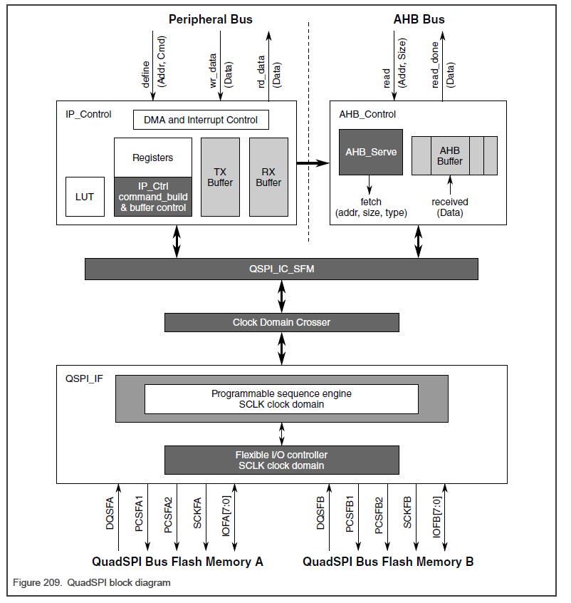

<section id="title">Quad Serial Peripheral Interface (QuadSPI)</section>

# 1. 芯片特定的 QuadSPI 配置

## 1.1. 概述

**QuadSPI** 模块和相关的 **PHY** 为单通道、双通道、四通道和八通道 **NOR** 闪存（包括 **Hyperflash** 存储器）提供通用存储器接口。 

**QuadSPI** 的主要用例是与外部闪存和八进制 **PSRAM** 连接。闪存接口支持以下外部 **NOR** 闪存：

* 8 位宽总线 (x8) DDR NOR、OctaFlash™、XTRM 和 HyperFlash™ 闪存
* 4 位宽总线 (x4) SDR 和 DDR 四通道 NOR 闪存
* 赛普拉斯（**Cypress**） QuadFlash 存储器
* 八路 PSRAM 存储器
  
对于 **QuadSPI** 引脚映射，请参阅本文档随附的 **IOMUX** 电子表格中的器件“输入复用”选项卡。

有关目标频率，请参阅芯片数据表。

## 1.2. 支持的模式

有关详细信息，请参阅器件数据手册 QuadSPI 配置部分。

## 1.3. QuadSPI 时钟

总线时钟周期与闪存时钟周期之比不得小于 1:5。总线时钟周期与内部参考时钟的比值不得小于由下式得出的值。更多详细信息，请参见芯片数据手册。

* Flash 读取时序必须满足以下条件：
从闪存中获取下一个 **n** 位数据（其中 **n** 可以是 **64**、**32** 或 **16**）所需的时钟周期数的总时间段必须大于两个总线时钟周期。

* 使用以下等式导出 DDR 八进制写入：
(3 x 闪存时钟周期) + (3 x 总线时钟周期) < (8 x 闪存时钟周期)

## 1.4. QuadSPI 限制

QuadSPI 在该芯片中的实现有以下限制：

* 不支持 DDR 中心对齐读取选通 (DCARS) 闪存。
* 该芯片不支持用于 **AHB** 读取的 **WRAP** 事务。
* 在配置 **QuadSPI** 之前对 **QuadSPI** 内存映射区域**00000000h-20000000h** 的任何推测性访问都可能导致意外的芯片行为。因此，在这种情况下，您必须使用核心编程来禁用对该区域的推测访问。
* 要求应用程序必须依靠 **FCCU** 故障来处理 **ECC** 错误，方法是将 '0' 写入**QuadSPI**的 RSER[CRCBIE] 和 RSER[CRCAIE]。如果未配置 **FCCU**（例如，在客户引导加载程序中），则必须启用这些字段。

## 1.5. 芯片特定的功能配置

此芯片上的 **QuadSPI** 实例不支持外设芯片选择 (**PCS**)。忽略它在本章中的引用。

此芯片上的 **QuadSPI** 实例仅支持 **66MHz** 的自动学习功能。更多详细信息，请参见芯片数据手册。

在第一个 **AHB** 读取事务之前重置（刷新）**QSPI AHB** 缓冲区和 **IPS** 域，或者如果您重新配置它们。

# 2. 介绍

**QuadSPI** 模块充当一个或两个外部 **SFM** 设备的接口，每个设备最多有 **8** 条双向数据线。

## 2.1. 功能

**QuadSPI** 支持以下功能：

* 灵活的序列引擎支持各种闪存供应商设备。由于没有特定的标准，该模块支持来自不同厂商的各种闪存。有关示例序列，请参阅串行闪存设备。
* **Quad** 闪存支持单、双和四操作模式。
* 八通道闪存支持八通道和单通道 IO 操作模式。
* 双倍数据速率**DDR**（**Double Data Rate**）/ 双倍传输速率**DTR**（**Double Transfer Rate**）模式，其中数据在串行闪存时钟的每个边沿生成。
* 闪存数据选通信号，支持双倍数据速率（**DDR**） 和单数据速率 (**SDR**) 模式下的数据采样。
* 支持 **Macronix** 八进制数据完整性功能，例如 ECC 和 R/W 奇偶校验 (CRC1)。
* 支持在单 I/O 模式下通过寄存器映射接口进行并行写入。
* 能够连接两个相同的串行闪存设备并同时访问它们以进行数据读取操作，形成一个具有双倍读出带宽的（虚拟）闪存。
* **AHB master** 通过 **AMBA AHB**（64位宽度接口）或 **IPS** 寄存器空间（32位访问）读取 **RX** 缓冲区数据，并通过 **IPS** 寄存器空间（32位访问）或使用 **AHB**（64位宽度）填充 **TX** 缓冲区界面。
  * **AHB master** 可以是具有可配置内部循环大小的 **DMA**。
* 允许**Multi-master**访问，但使用动态 **AES** 解密**OTFAD**（**On-the-fly AES decryption**）仅支持单主机访问。
  * 每个主设备的灵活且可配置的缓冲区，总可用缓冲区大小为 **1024** 字节。
* 所有对闪存/RAM 存储器设备的 **AHB** 访问都是直接映射到芯片系统存储器的存储器。
* 可编程序列引擎，以适应未来的命令/协议变化，并能够支持所有现有的供应商命令和操作。软件需要根据所连接的闪存设备选择相应的序列。
  * 支持所有类型的寻址
* 支持与 **OTFAD**（**On-the-fly AES decryption**）的交互。

**注释：**

**AHB**：**Advanced high-performance bus**
> 先进的高性能总线，是**AMBA**的一个版本。

**AMBA**: **Advanced microcontroller bus architecture** 
> 先进的微控制器总线架构。

## 2.2. RX 缓冲区推送事件

**RX** 缓冲区推送事件是将有效条目添加到 **RX** 缓冲区。

默认情况下，每个缓冲区推送事件都会向 **RX** 缓冲区添加两个条目，因为串行时钟域的接口宽度为 **64** 位。根据从串行闪存设备读取的字节数，对于最后一个缓冲区推送事件，可能只添加一个条目。

当 **RX** 缓冲区的条目数增加，RBSR[RDBFL] 也会被增加。

## 2.3. RX 缓冲区弹出事件

**RX** 缓冲区弹出事件是将有效条目从 **RX** 缓冲区中删除。

每个缓冲区弹出事件从缓冲区中删除 (RBCT[WMRK] + 1) 个有效条目。BSR[RDBFL] 减少相应的条目数，而 RBSR[RDCTR] 则增加相应的条目数。

## 2.4. Block diagram

##  2.5. QuadSPI 操作模式

QuadSPI 支持以下操作模式：

* 正常模式：您可以使用此模式对外部串行闪存设备进行写或读访问。有关详细信息，请参阅普通模式。
  - 串行闪存写入：您只能通过 IP 接口将数据写入闪存。有关详细信息，请参阅闪存编程。
  - 串行闪存读取：读取串行闪存设备的内容。通过 RX 缓冲区和 AHB 缓冲区可以使用两个单独的读取通道。有关详细信息，请参阅闪存读取。
* 模块禁用模式：您可以使用该模式禁用串行闪存时钟和 AHB 命令。QuadSPI 中非内存映射逻辑的时钟可以在模块禁用模式下停止。模块通过设置 MCR[MDIS] 进入模式。

