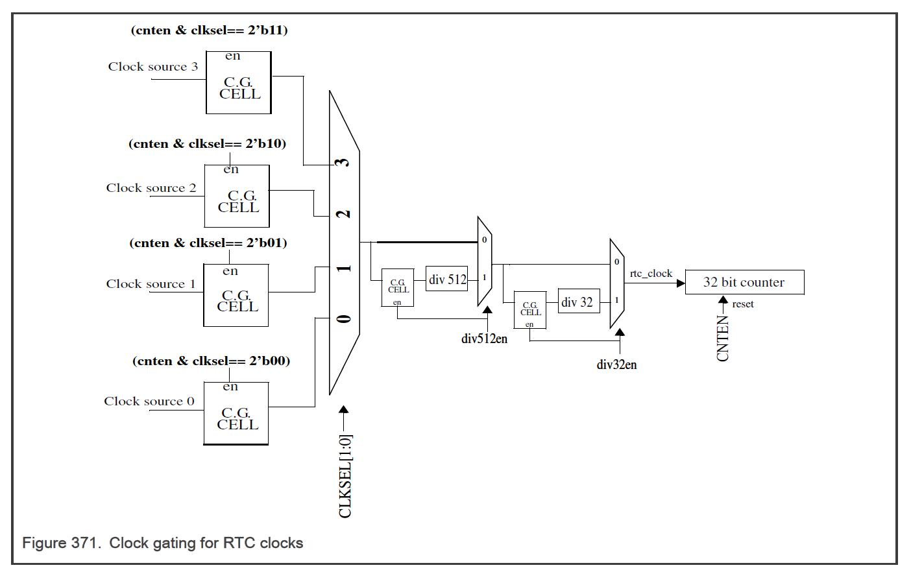

<section id="title">实时时钟 (**RTC**)</section>

# 1. 芯片特定的 RTC 信息

## 1.1. RTC 时钟

**SIRC** 是 **RTC** 模块在待机模式下唯一可用的时钟。有关 **SIRC** 规格，请参阅芯片数据表中的 **SIRC** 部分。

# 2. 介绍

实时时钟 (**RTC**) 是用于计时应用的自由运行计数器（**free-running counter**）。**RTC** 可以配置为以预定义的时间间隔生成中断。**RTC** 还支持用于生成周期性唤醒请求以退出低功耗模式或中断请求的 **API** 函数。

## 2.1. 功能

RTC 功能包括：

* 32 位计数器（**32-bit counter**）
* 可选计数器时钟源（IRC 和 OSC）
    * 时钟源 0（**Clock source 0**）
    * 时钟源 1（**Clock source 1**）
    * 时钟源 2（**Clock source 2**）
    * 时钟源 3（**Clock source 3**）
* 可选的 512 预分频器和可选的 32 预分频器来运行 32 位计数器。
* 带有中断使能的 RTC 中断。
* 计数器在所有操作模式下运行。
* **RTC** 计数器在计数器被软件禁用并复位到 **RTC** 模块时复位。
* 自主周期性中断支持包括：
    * 支持唤醒间隔/中断范围的 32 位比较值
    * API 逻辑具有单独的启用以支持在 RTC 运行时更改比较值
    * 带有中断使能的 API 中断
    * 在所有模式下运行
    * 可以在 RTC 运行时修改 API 比较值
* RTC 匹配、API 匹配和 RTC 翻转的可选中断。

## 2.2. 框图

下图显示了 RTC 时钟的时钟门控。

## 2.3. 操作模式

### 2.3.1. 功能模式

**RTC** 有两种功能操作模式：正常操作和低功耗模式。在正常操作中，可以读取或写入所有 **RTC** 寄存器。可选择启用 **RTC/API** 和相关中断。在低功耗模式下，总线接口被禁用。**RTC/API** 已启用（如果在进入低功耗模式之前启用）。

### 2.3.2. 调试模式

进入调试模式后，如果设置了 **FRZEN**，**RTC** 计数器将冻结在最后一个有效计数上。退出调试模式时，计数器从冻结值继续。

# 3. RTC 寄存器说明

# 4. 功能说明

## RTC

RTC 包含一个通过 **CNTEN** 位启用的 32 位自由运行计数器。**CNTEN**，当取反时，异步复位计数器并在启用时同步启用计数器。禁用 CNTEN 后，需要重新编写 RTCVAL、APIVAL 以获得所需的功能。 计数器的值可以通过 RTC 计数器寄存器 (RTCCNT) 寄存器读取。 请注意，由于时钟同步，RTC 计数器寄存器 (RTCCNT) 的值可能代表先前的计数器值。 计数器与读取值之间的差异取决于计数器时钟与总线时钟的比率。 两者之间的最大可能差异是 6 个计数值。

# 5. 推荐的编程流程

1. 如果需要 **RTCF** 相关功能，则将 **RTCVAL** 寄存器的值编程为大于 **4**。
2. 如果需要 **API** 功能，则将 **APIVAL** 寄存器的值编程为大于 **4**。
3. 使用 **CNTEN**=1 对 **RTC** 控制寄存器 (RTCC) 寄存器的所有字段（根据需要）进行编程。设置 CNTEN 字段后，计数器开始运行，RTC/API 功能将根据配置激活。
4. 如果 RTCVAL 或 APIVAL 在运行过程中需要更新，请在写入前检查相应的 INV_RTC 或 INV_API 位是否清零，并满足相应寄存器的所有限制。
5. 如果需要更新 CLKSEL 或 DIV32EN 或 DIV512EN，首先更新 RTC 控制寄存器 (RTCC) 寄存器，设置 CNTEN=0（当所有 INV_RTC 或 INV_API 为 0 时）保持其他字段值相同。 等待至少 3 个 RTC 时钟周期，以便 CNTEN 与 RTC 时钟域同步。然后使用 CNTEN=1 所需的新配置写入 RTC 控制寄存器 (RTCC) 寄存器。