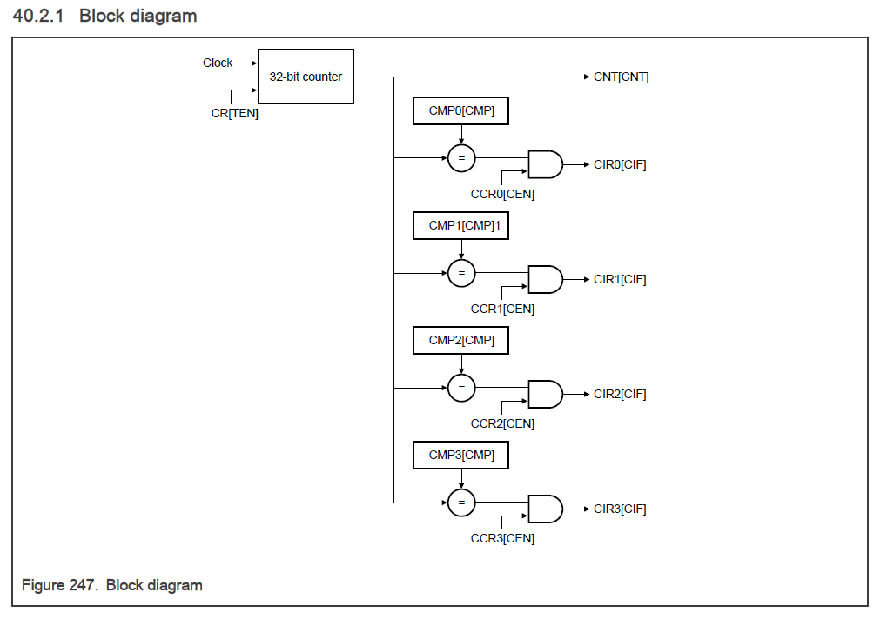

<section id="title">系统定时器模块 (**STM**)</section>

# 1. 芯片特有的STM信息

## 1.1. STM 实例

该芯片实现：

* 一个与时间戳绑定的 STM (**STM_7**)
* 八个通用**STM**，如下：
    * STM_0
    * STM_1
    * STM_2
    * STM_3
    * STM_4
    * STM_5
    * STM_6
    * STM_TS

# 2. 概述

**STM** 支持常用的系统和应用软件定时功能。**STM** 包括一个 **32** 位向上计数定时器和四个 **32** 位比较通道，每个通道都有一个单独的中断源。每个定时器通过 **STM** 模块时钟的**8**位预分频值（**8-bit prescale value**）的方式驱动。

## 2.1. 特性

STM 具有以下特性：

* 一个带有8位预分频器（**8-bit prescaler**）的32位递增定时器（**count-up timer**）。
* 四个32位比较通道（**32-bit compare channel**）。
* 每个比较通道都有一个独立的中断源。
* 能够在调试模式下停止定时器。

# 3. STM_TS 寄存器说明

STM 编程模型只允许32位字（**32-bit word**）访问。使用不同大小或对保留地址的引用尝试会生成总线错误终止。

## 3.1. STM_TS 内存映射

**STM_TS**基地址：**4400_C000h**

# 4. STM 寄存器说明

STM 编程模型只允许32位字（**32-bit word**）访问。使用不同大小或对保留地址的尝试引用会生成总线错误终止。

## 4.1. STM 内存映射

**STM_0** 基地址：**4011_C000h**
**STM_1** 基地址：**4012_0000h**
**STM_2** 基地址：**4012_4000h**
**STM_3** 基地址：**4012_8000h**
**STM_4** 基地址：**4021_C000h**
**STM_5** 基地址：**4022_0000h**
**STM_6** 基地址：**4022_4000h**
**STM_7** 基地址：**4022_8000h**

# 5. 功能说明

## 5.1. 向上计数定时器（Count-up timer）

STM 有一个 32 位向上计数定时器，用作四个比较通道的时基（**time base**）。启用时计数器以模块时钟频率除以 1 到 256 范围内的预分频器值递增。在正常模式下启用时，定时器连续递增。计数器在计数到 **FFFF_FFFFh** 时，会翻转到 **0000_0000h**，在此边界没有任何限制。

## 5.2. 比较频道（Compare channel）

STM 有四个相同的比较通道。每个通道包括一个通道控制寄存器（CCRn）、一个通道中断寄存器（CCRn）和一个通道比较寄存器（CMPn）。当通道使能且其通道比较值与定时器计数匹配时，**STM** 设置通道中断标志并在该通道上生成一个 **IRQ**。

## 5.3. 不同芯片模式下的行为

STM 支持的芯片工作模式如下：

| 芯片模式 | STM 行为                                                                                   |
| -------- | ------------------------------------------------------------------------------------------ |
| 正常     | 当定时器使能时（CR[TEN] = 1），定时器连续递增计数。                                        |
| 调试     | 如果 CR[FRZ] = 1，STM 停止定时器。 否则，当定时器使能时（CR[TEN] = 1），定时器不断地计数。 |

## 5.4. 时钟（Clocking）

该模块没有时钟考虑。

## 5.5. 中断

STM 可以产生通道中断。 有关信息，请参阅：

* [比较频道](#52-比较频道compare-channel)
* 响应比较频道事件
* 通道中断（CIR0 - CIR3）

# 6. 外部信号

该模块没有外部信号

# 7. 初始化

该模块不需要初始化。

# 8. 应用开发信息（Application information）

## 8.1. 配置定时器

1. 设置初始定时器计数 (CNT[CNT])。
2. 指定芯片调试模式下的 STM 行为（CNT[FRZ]）。
3. 设置计数器预分频器 (CR[CPS])。
4. 启动定时器（CR[TEN]）。
   
##  8.2. 配置比较通道

对于每个比较通道：

1. 设置通道比较值 (CMPn[CMP])。
2. 启用比较通道（CCRn[CEN]）。

## 8.3. 响应比较通道事件

对于每个比较通道：

1. 检查通道中断标志 (CIRn[CIF])。
2. 如果通道中断标志置位，则响应中断请求。
3. 处理完通道中断后，清除通道中断标志（CIRn[CIF]）。